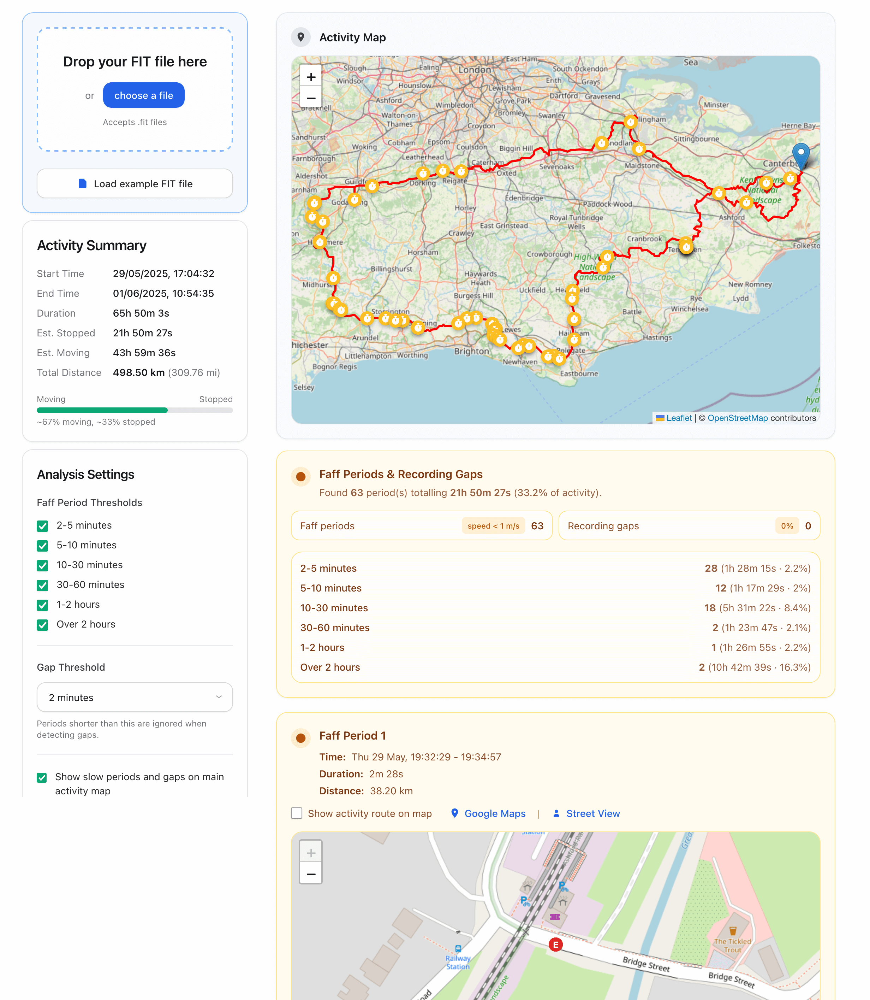

# Ultra Cycling Faff Time Analyser

Ultra Cycling Faff Time Analyser helps ultra-distance riders understand where their time went during long events. Drop a Garmin FIT file into the React dashboard to explore faff/stop detection, gap analysis, and route visualisation – everything runs locally in the browser via the official Garmin FIT SDK.

Use the tool live at [https://fafftime.com](https://fafftime.com)

> 🤖 Built with a good mix of elbow grease, [Claude Code](https://claude.ai/code), and [OpenAI Codex](https://openai.com/codex/).

## Screenshot



## Key Features

- **Client-side Garmin FIT decoding** using `@garmin/fitsdk` with no server round trips
- **Faff and gap analysis** that surfaces slow periods, paused logging, and configurable stop thresholds
- **Comprehensive ride summary** for elapsed vs moving time, total distance, and key timestamps
- **Leaflet-powered mapping** with the full activity trace, per-period mini-maps, and Google Maps deep links
- **React UI workflow** with drag-and-drop uploads, instant recalculation, and tweakable analysis controls

## Project Structure

```
src/
├─ core/              # Pure TypeScript analysis pipeline and FIT helpers
├─ ui/
│  ├─ App.tsx         # React shell wiring up state + layout
│  ├─ components/     # Feature-focused UI components (summary cards, lists, dropzone)
│  ├─ hooks/          # Shared UI hooks for analysis results and map lifecycle
│  └─ map-manager.ts  # Leaflet integration shared by the React layer
├─ utils/             # Cross-cutting helpers (constants, analytics, GPS math)
├─ types/             # Shared TypeScript definitions consumed across modules
├─ assets/            # Static assets (icons, fonts, example data, screenshots)
├─ main.tsx           # React entry point rendered by webpack
├─ main.ts            # Analysis API surface consumed by Vitest
├─ index.html         # HtmlWebpackPlugin template bootstrapping the app
└─ styles.css         # Global styles imported into the UI bundle

tests/
└─ main.test.ts       # Vitest suite exercising the exported analysis API

webpack.config.js     # Bundler configuration for dev and production builds
vitest.config.js      # Testing configuration (JSDOM, coverage)
deploy.sh             # Staging/production helper script invoked via npm scripts
```

## Getting Started

### Prerequisites

- Node.js 18+
- npm (ships with Node)
- A modern browser (Chrome, Firefox, Edge, Safari) for running the UI

### Install & Run

```bash
npm install
npm start           # webpack dev server with live reload at http://localhost:3000

# alternative workflows
npm run dev         # watch + rebuild without serving (great for TypeScript feedback)
npm run build       # create a production bundle in dist/
```

## Testing

```bash
npm test            # run the Vitest suite
npm run test:watch  # watch mode while iterating on logic
npm run test:coverage  # generate coverage reports in coverage/
```

The tests focus on the exported analysis helpers in `src/main.ts`. Add coverage for new analysis branches and verify changes locally before opening a PR.

## Deployment

Deploy helper scripts wrap `deploy.sh`:

```bash
npm run deploy:staging
npm run deploy:production
```

Run `npm run build` first if you need to validate the production bundle before promoting it.

## Tech Stack

- **UI**: React 18 + TypeScript + custom hooks/components
- **Analysis**: Pure TypeScript modules in `src/core/` using Garmin's FIT SDK
- **Mapping**: Leaflet with OpenStreetMap tiles
- **Tooling**: Webpack 5, Vitest, HtmlWebpackPlugin, CopyWebpackPlugin

## Contributing

1. Create a feature branch and install dependencies.
2. Keep TypeScript happy (`npm run dev` or your editor's TS integration helps catch errors early).
3. Run `npm test` before opening a PR; share screenshots for UI-visible tweaks.
4. Mention breaking analysis changes or new configuration defaults in the PR description.

## License

MIT License. Garmin FIT SDK usage is governed by the Flexible and Interoperable Data Transfer (FIT) Protocol License.
