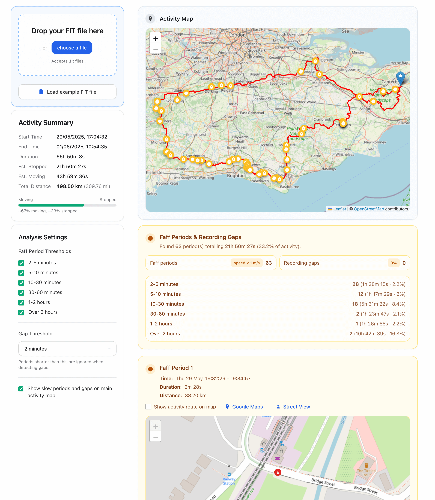

# Ultra Cycling Faff Time Analyser

Ultra Cycling Faff Time Analyser helps ultra-distance riders understand where their time went during long events. Drop a Garmin FIT file into the React dashboard to explore faff/stop detection, gap analysis, and route visualisation – everything runs locally in the browser via the official Garmin FIT SDK.

Use the tool live at [https://fafftime.com](https://fafftime.com)

## Screenshot



## Key Features

- **Client-side Garmin FIT decoding** using `@garmin/fitsdk` with no server round trips
- **Faff and gap analysis** that surfaces slow periods, paused logging, and configurable stop thresholds
- **Comprehensive ride summary** for elapsed vs moving time, total distance, and key timestamps
- **Leaflet-powered mapping** with the full activity trace, per-period mini-maps, and Google Maps / Street View deep links
- **CSV export** of faff periods and recording gaps for further analysis in a spreadsheet
- **React UI workflow** with drag-and-drop uploads, a bundled example FIT file, instant recalculation, and tweakable analysis controls

## Project Structure

```
src/
├─ core/              # Pure TypeScript analysis pipeline and FIT helpers (with colocated tests)
├─ ui/
│  ├─ App.tsx         # React shell wiring up state + layout
│  ├─ components/     # Feature-focused UI components (summary cards, lists, dropzone)
│  ├─ hooks/          # Shared UI hooks for analysis results and map lifecycle
│  └─ map-manager.ts  # Leaflet integration shared by the React layer
├─ components/ui/     # shadcn/ui components (created when first added via the shadcn CLI)
├─ lib/               # Shared utilities (clsx + tailwind-merge helpers)
├─ utils/             # Cross-cutting helpers (constants, analytics, GPS/time math, CSV export)
├─ types/             # Shared TypeScript definitions consumed across modules
├─ assets/            # Static assets (icons, example FIT data, images)
├─ main.tsx           # React entry point
├─ main.ts            # Analysis API surface consumed by tests
├─ site.webmanifest   # Web app manifest (copied to dist/ at build time)
└─ tailwind.css       # Tailwind entry stylesheet

index.html            # Vite HTML template (loads Leaflet via CDN)
vite.config.ts        # Vite dev server and build configuration
vitest.config.js      # Testing configuration (JSDOM, coverage)
tailwind.config.js    # Tailwind configuration
postcss.config.js     # PostCSS configuration
components.json       # shadcn/ui configuration
deploy.sh             # Production deploy script invoked via npm scripts
```

## Getting Started

### Prerequisites

- Node.js 26+ (see `.nvmrc`)
- npm (ships with Node)
- A modern browser (Chrome, Firefox, Edge, Safari) for running the UI

### Install & Run

```bash
npm install
npm start           # Vite dev server with hot reload at http://localhost:3000

# alternative workflows
npm run dev         # same as npm start (npm run serve is also an alias)
npm run build       # create a production bundle in dist/
npm run preview     # serve the production build locally
```

## Testing

```bash
npm test               # run the Vitest suite
npm run test:watch     # watch mode while iterating on logic
npm run test:coverage  # generate coverage reports in coverage/
npm run test:ui        # open the Vitest UI (requires @vitest/ui)
```

Tests are colocated with the code they cover (`src/**/*.test.ts`), including the exported analysis API in `src/main.test.ts`. Add coverage for new analysis branches and verify changes locally before opening a PR. See [TESTING.md](TESTING.md) for more detail.

## Deployment

`deploy.sh` builds the app and syncs `dist/` to production (fafftime.com):

```bash
npm run deploy:production   # also available as npm run deploy
```

There is no staging environment, so preview the production bundle locally with `npm run build && npm run preview` before deploying.

## Tech Stack

- **UI**: React 18 + TypeScript + custom hooks/components
- **Styling**: Tailwind CSS + PostCSS, shadcn/ui (class-variance-authority, clsx, tailwind-merge, tailwindcss-animate)
- **Analysis**: Pure TypeScript modules in `src/core/` using Garmin's FIT SDK
- **Mapping**: Leaflet + leaflet-polylinedecorator (loaded via CDN) with OpenStreetMap tiles
- **Tooling**: Vite 7, Vitest, vite-plugin-static-copy
- **Icons**: Font Awesome 7 (imported via `@fortawesome/fontawesome-free`)

## Contributing

1. Create a feature branch and install dependencies.
2. Keep TypeScript happy (`npx tsc --noEmit` or your editor's TS integration helps catch errors early — `vite build` does not type-check).
3. Run `npm test` before opening a PR; share screenshots for UI-visible tweaks.
4. Mention breaking analysis changes or new configuration defaults in the PR description.

## License

MIT License. Garmin FIT SDK usage is governed by the Flexible and Interoperable Data Transfer (FIT) Protocol License.
